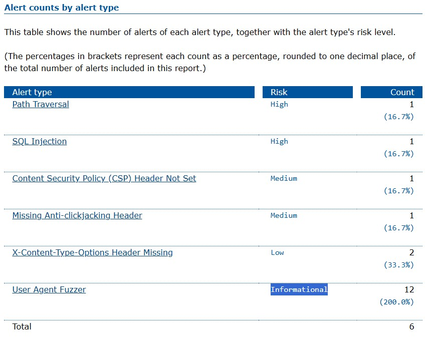

# Shiny-waddle
Cybersecurity and data privacy

# Logbook
## Day 1
- Created the Github repo.
- Added a logbook.md file into the repo.
- Made the reop is accessible to the teacher.

## Table
| Date | Description | Used time |
| :---         |     :---:      |          ---: |
| 11/4/2024 | The Repo has been created after watch the tutorial | 15 min |
| 11/6/2024 | Lab: SQL injection vulnerability in WHERE clause allowing retrieval of hidden data | 15 min |
| 11/8/2024 | Lab: SQL injection vulnerability allowing login bypass | 30 min |
| 11/8/2024 | Lab: SQL injection attack, querying the database type and version on Oracle | 30 min |
| 11/8/2024 | Lab: SQL injection attack, querying the database type and version on MySQL and Microsoft | 30 min |
| 11/6/2024 | Lab: Username enumeration via different responses | 20 min |
| 11/9/2024 | Lab: 2FA simple bypass | 30 min |
| 11/9/2024 | Lab: Password reset broken logic | 30 min |
| 11/9/2024 | Lab: Username enumeration via response timing | 30 min |
| 11/7/2024 | Lab: Unprotected admin functionality | 15 min |
| 11/10/2024 | Lab: Unprotected admin functionality with unpredictable URL | 30 min |
| 11/10/2024 | Lab: User role controlled by request parameter | 30 min |
| 11/22/2024 | The Booking system project → Phase 1 | 8 hour |

----------------------------------------------------------------------------------------------------------
## Introduction to the portswigger environment (Lab )
| Date | Topic (Lab) |Description (Lab) | Reflection Status |
| :---         |     :---:      |     :---:      |          ---: |
| 11/6/2024 | SQL injection | SQL injection vulnerability in WHERE clause allowing retrieval of hidden data | Submitted |
| 11/6/2024 | Authentication | Username enumeration via different responses | Submitted |
| 11/7/2024 | Access control | Unprotected admin functionality | Submitted |

---------------------------------------------------------------------------------------------------------------------
## The Booking system project → Phase 2
1. [Link to first report](https://github.com/Sakhawat2/Shiny-waddle/blob/main/project%20%E2%86%92%20Phase%202/Before_fix/First%20before%20fixing-.md)
2. [Link to app.js](https://github.com/Sakhawat2/Shiny-waddle/blob/main/project%20%E2%86%92%20Phase%202/Before_fix/app.js)
3. [Link to whole code for before fix](https://github.com/Sakhawat2/Shiny-waddle/tree/main/project%20%E2%86%92%20Phase%202/Before_fix)
4. [Link to Second Report]( https://github.com/Sakhawat2/Shiny-waddle/blob/main/After_fix/SecondReport-.md)
5. [Link to app.js_second](https://github.com/Sakhawat2/Shiny-waddle/blob/main/After_fix/app.js)
6. [Link to whole code](https://github.com/Sakhawat2/Shiny-waddle/tree/main/After_fix)
   
### Details Report
a.	Implemented the index page

b.	Solved the Content Security Policy (CSP) Header alert.

Added into app.js

// Middleware to set CSP header

app.use('*', (c, next) => {

    c.header('Content-Security-Policy', "default-src 'self'");
    
    return next(); })

----------------------------------------------------------------------------------------------------
## The Booking system project → Phase 1
1. [First Report](First_generate_report.MD)

2. [Second Report](Second_generate_report.MD) 

### Details
There were 6 Alart. There were 6 risks. Alert Path Traversal and SQL Injection was high. Content Security Policy (CSP) Header Not Set and Missing Anti-clickjacking Header alert is medium. X-Content-Type-Options Header Missing alert is low and User Agent Fuzzer is Informational. 

